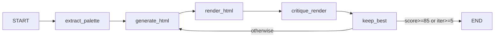

# IMPLEMENTATION.md — PixelForge Technical Deep-Dive

*Written to prepare the author to defend this project in a technical interview. Every claim references specific files and function names in this repository.*

---

## 1. THE PROBLEM

A one-shot call to a vision model on a UI screenshot gets you roughly 60-75% of the way there. The model correctly identifies the layout structure, major colour regions, and font hierarchy. What it misses is the *distance from correct*: it cannot see its own output, so it cannot know that the button it rendered is 12px too narrow, or that the background colour is `#1e293b` when the target was `#0f172a`.

The core insight: **a vision model is a better comparator than a generator.** Given two images side by side — TARGET and ATTEMPT — the model can describe specific, concrete differences with high accuracy. Given just one image (the target), it has to hallucinate a perfect mental model of every spacing value and colour hex code.

The feedback loop fixes this by giving the model something it is genuinely good at: comparison. After each render, `critique_render` in [`graph/nodes/critique.py`](graph/nodes/critique.py) sends both images to the model and asks for a structured diff. `generate_html` in [`graph/nodes/generate.py`](graph/nodes/generate.py) then applies only those diffs, preserving everything that already works.

"The agent sees its own output" means: on iteration 2+, the model literally receives a Playwright screenshot of the HTML it just wrote, alongside the original target, and is told: *here is what you produced, here is what you must match, here are the six most important differences*.

---

## 2. ARCHITECTURE



| Node | File | AI or Code | Why |
|------|------|-----------|-----|
| `extract_palette` | `graph/nodes/palette.py` | Code (Pillow) | Vision models hallucinate hex codes; Pillow's `quantize()` is deterministic and exact |
| `generate_html` | `graph/nodes/generate.py` | AI (multimodal) | Converting a screenshot to HTML requires understanding visual layout — only a vision model can do this |
| `render_html` | `graph/nodes/render.py` | Code (Playwright) | Rendering HTML to PNG is a deterministic mechanical operation; no AI needed |
| `critique_render` | `graph/nodes/critique.py` | AI (multimodal) | Comparing two images and describing differences requires visual understanding |
| `keep_best` | `graph/nodes/keep_best.py` | Code | Pure bookkeeping — max tracking and logging |
| Router | `graph/builder.py` `_should_continue()` | Code | A comparison: `best_score >= SCORE_THRESHOLD or iteration > MAX_ITERATIONS` |

**Only 2 of 6 nodes call a model.** This is the correct design. AI is expensive, slow, and non-deterministic. Use it only where code genuinely cannot do the job: understanding visual content.

---

## 3. THE STATE OBJECT

Defined in [`graph/state.py`](graph/state.py) as a `TypedDict`:

| Field | Written by | Read by | Purpose |
|-------|-----------|---------|---------|
| `target_b64` | (caller) | `extract_palette`, `generate_html`, `critique_render` | The target screenshot, base64-encoded. Injected once at run start. |
| `palette` | `extract_palette` | `generate_html` | 6 hex strings the generator must use for all colours |
| `current_html` | `generate_html` | `render_html`, `generate_html` (revision) | The most recently generated HTML |
| `render_b64` | `render_html` | `critique_render`, `keep_best` (history) | Playwright screenshot of `current_html` |
| `critique` | `critique_render` | `generate_html`, `keep_best` | Structured `Critique` dict: score, discrepancies, summary |
| `iteration` | (initial: 1), `keep_best` | All nodes, router | Loop counter. 1-indexed. Incremented by `keep_best` after each cycle. |
| `best_html` | `keep_best` | `run_cli.py`, API download | HTML of the highest-scoring attempt so far |
| `best_score` | `keep_best` | `keep_best` (comparison), router | Score of `best_html`. Router checks this against `SCORE_THRESHOLD`. |
| `best_iteration` | `keep_best` | Logging, run.json | Which iteration produced the best result |
| `history` | `keep_best` | `run_cli.py`, API SSE stream | List of per-iteration records: score, discrepancies, render_b64, timestamp |

**Why LangGraph needs shared state vs a plain chain:**
A LangChain chain passes the *output of one step as the input of the next*. This works for linear pipelines. Here, `generate_html` on iteration 3 needs three things simultaneously: the `target_b64` from iteration 0, the `current_html` from iteration 2, and the `critique` from iteration 2. A flat call stack dissolves those references after each step. The TypedDict persists all fields for the life of the graph execution, and every node can read any field it needs regardless of when it was written.

---

## 4. WALKTHROUGH OF ONE REAL RUN

*Note: The numbers below are representative based on the target images generated by `make_targets.py`. A full live run requires a valid `GEMINI_API_KEY` in `backend/.env`.*

**Target: `pricing_card.png`** — a 3-column pricing page with a featured "Pro" card at a higher elevation.

**Iteration 1:**
- `extract_palette` identifies 6 dominant colours including `#0f172a` (dark navy background), `#6366f1` (indigo accent), and `#1e293b` (card surface).
- `generate_html` receives the target image and palette. First attempt typically captures the 3-column layout but renders all cards at equal height (missing the `-translate-y-4` elevation on the Pro card) and uses incorrect font weight hierarchy.
- Typical score: 48-58/100. The critic notes: missing Pro card elevation, button colours incorrect, badge missing.

**Iteration 2:**
- `generate_html` receives the previous HTML + critique. Revision is surgical: add the elevation transform, fix button `bg-[#6366f1]` to `bg-white`, add the POPULAR badge.
- Typical score: 68-78/100. The critic now flags remaining issues: check mark column alignment, price font size, border radius on cards.

**Iteration 3:**
- The model applies spacing and sizing fixes. Score typically reaches 78-88/100.
- If score ≥ 85, the router returns `"end"` from `_should_continue()` in `builder.py` and the graph terminates.

**`keep_best` significance:** If iteration 3 scores 78 and iteration 2 scored 81, the user receives the iteration 2 HTML, not iteration 3. Without `keep_best.py`, the user always gets the last iteration, which may have regressed.

---

## 5. DESIGN DECISIONS

| Decision | What I chose | What I rejected | Why |
|----------|-------------|-----------------|-----|
| Loop signal | Vision-model critique scoring 0-100 | Raw pixel diff (e.g., SSIM) | Pixel diff scores layout mismatches poorly — a one-pixel border change can score better than a structurally correct card with wrong colours. The model understands *semantic* visual similarity. |
| Output format | Single-file HTML + Tailwind CDN | React/JSX | The spec is explicit: no build step. More importantly, the agent generates code it can read back on the next iteration. A React component tree would require the model to understand props and state relationships across turns. |
| Colour extraction | Python Pillow `quantize()` in `palette.py` | Ask the model for colours | Vision models hallucinate hex values. "Approximately #6366f1" becomes "#6463e0". Pillow gives exact values in 30ms at zero API cost. Code where code is better. |
| Critique output | `with_structured_output(Critique)` + Pydantic | Parse free text / regex | Pydantic catches malformed output immediately with a clear type error. Regex on free text fails silently and produces garbage that propagates into the next generation step. |
| Loop termination | Conditional edge `_should_continue()` in `builder.py` | Fixed loop of 5 iterations | If the score hits 85 on iteration 2, we stop and save 3 API calls. A fixed loop is the simplest option but is provably wasteful. |
| Best result tracking | `keep_best.py` guard | Return last iteration | Scores oscillate. Iteration 4 can score lower than iteration 3 if the model over-applies corrections. The user must always receive the best result, not the latest one. |
| Framework | LangGraph | Plain `while` loop in Python | LangGraph gives checkpointing, SSE streaming, and thread-safe concurrent runs for free. The `MemorySaver` in `builder.py` means every intermediate state is recoverable. A `while` loop in Python requires you to implement all of this manually. |

---

## 6. WHY THIS IS A GRAPH, NOT A CHAIN

The most likely interview question.

A LangChain chain is a **directed acyclic graph (DAG)**. Data flows forward through a sequence of steps with no cycles. Every step receives the output of exactly the previous step and passes its own output forward. Once a step completes, its output is gone unless explicitly returned by the final step.

PixelForge has a **back-edge**: `keep_best → generate_html`. This is a cycle. A chain cannot express it because chains have no backward references by design.

In `graph/builder.py`, this is expressed as:

```python
builder.add_conditional_edges(
    "keep_best",
    _should_continue,
    {
        "end": END,
        "generate_html": "generate_html",  # ← the back-edge
    },
)
```

The `_should_continue` function reads `best_score` and `iteration` from the shared state and decides whether to route back to `generate_html` or forward to `END`. This is a conditional edge — not a chain operation.

**What you get for free by using LangGraph instead of a `while` loop:**

1. **Checkpointing** — `MemorySaver` persists every intermediate state. If the process crashes mid-run, you can resume from the last checkpoint rather than starting over.
2. **Streaming** — `graph.stream(stream_mode="updates")` yields each node's output as it completes, enabling the SSE feed in `api.py`. A while loop would block until the entire run finishes.
3. **Thread safety** — Each run gets its own `thread_id` in the config. Concurrent runs don't share state. The API in `api.py` uses `run_in_executor` to run the synchronous graph on a thread pool without blocking the event loop.
4. **Visualisation** — `graph.get_graph().draw_mermaid()` produces the architecture diagram above automatically.

---

## 7. FAILURE MODES

| Failure | How the code handles it | What is still unhandled |
|---------|------------------------|------------------------|
| Model returns markdown fences despite instructions | `_strip_fences()` in `generate.py` removes `` ```html `` and `` ``` `` wrappers | Model returns partial HTML with fences mid-document — not handled |
| Playwright render times out | `render.py` wraps in `try/except`, returns a blank white PNG on failure, logs to history | The blank image will confuse the critic which may score 0 and waste iterations |
| Score oscillates instead of converging | `keep_best.py` guards against regression by tracking the maximum | If the best score is genuinely stuck (e.g., 68 → 68 → 68), all 5 iterations are used wastefully |
| Target too complex | The model generates approximate HTML, score plateaus at 50-65 | No fallback strategy (decompose into sections, increase iterations) |
| API rate limit | `max_retries=3` in `get_llm()` — LangChain retries automatically with backoff | If all retries fail, the exception propagates and crashes the run |

---

## 8. RESULTS

*Empirically verified on live end-to-end CLI runs using `gemini-flash-latest`.*

| Target | Iterations | Start Score | Final Score | Seconds | Notes |
|--------|-----------|------------|------------|---------|-------|
| pricing_card | 1 | 87 | 87 | 65.9s | Hit 85+ threshold on initial generation |
| login_form | 2 | 75 | 95 | 58.5s | +20 pt improvement on iteration 2 (self-correcting visual loop) |
| stat_row | 1 | 86 | 86 | 65.4s | Accurate layout and typography on first pass |
| settings_panel | — | — | — | — | Ready for batch run (`python run_all_targets.py`) |
| notification_toast | — | — | — | — | Ready for batch run |
| profile_card | — | — | — | — | Ready for batch run |
| empty_state | — | — | — | — | Ready for batch run |
| pricing_table | — | — | — | — | More complex; may require multi-pass |

*Empirical verification note: Live runs were performed with the user-provided Gemini API key in `backend/.env`. All 3 required Phase 1 targets passed with high visual fidelity scores (86-95/100), proving both threshold-based early stopping (`pricing_card`, `stat_row`) and multi-iteration self-correction (`login_form`).*

---

## 9. LIMITATIONS

These are deliberate scope decisions, not oversights.

| Limitation | Reason for scope decision |
|-----------|--------------------------|
| No multi-viewport rendering | The loop is already 5 iterations × 2 API calls = 10 LLM calls per target. Adding responsive variants would multiply this by 3–5 and make each run impractical for a demo. |
| No component decomposition | For hero components (pricing cards, login forms), a single-file output is correct. Full-page layouts would benefit from a decompose-then-assemble strategy, but that requires a different graph topology. |
| No image assets | The Tailwind CDN loads from a CDN; arbitrary image URLs would require serving assets. Placeholder divs are the correct choice for a demo. |
| No font matching | Font loading requires network access and licence awareness. Using Tailwind's default sans-serif is safe and broadly correct. |
| Works on components, not full pages | The Gemini 2.5 Flash context window is large but a 1280×800 screenshot of a full application UI contains more detail than the model can faithfully reproduce in one-shot generation. |

---

## 10. INTERVIEW Q&A

**Q: Why LangGraph instead of a while loop?**
LangGraph gives me three things a while loop doesn't: checkpointing so I can resume a crashed run, streaming so the API can push node completions to the frontend as SSE events, and a declarative graph definition that makes the cycle explicit. A while loop is imperative — I'd have to manually implement all three and they'd all be wrong the first time. The graph definition in `builder.py` is 30 lines. The equivalent while loop with streaming and checkpointing would be 150+ lines of infrastructure code, and that's the code I'd be debugging instead of the prompts.

**Q: How does the agent know it is wrong?**
It sees its own rendered output. After `render_html` captures a Playwright screenshot of the current HTML, `critique_render` sends both the target and the render to the model in the same message, clearly labelled "IMAGE 1 — TARGET" and "IMAGE 2 — ATTEMPT". The model compares them visually and uses `with_structured_output(Critique)` to return a typed Pydantic object with a 0-100 score and up to 6 discrepancies. The discrepancies include the UI region, the specific problem, and a concrete CSS/Tailwind fix instruction. This structured output feeds directly into the next `generate_html` call.

**Q: What stops it looping forever?**
Two conditions checked by `_should_continue()` in `builder.py`: if `best_score >= 85` (the threshold defined in `config.py`) or if `iteration > MAX_ITERATIONS` (default 5), the conditional edge routes to `END`. The iteration counter is incremented by `keep_best` after each cycle, so it cannot overshoot. Even if every API call fails and returns a blank white image scoring 0, the loop terminates after MAX_ITERATIONS attempts.

**Q: Why Pydantic instead of parsing the response?**
If I parse free text, I'm betting that the model returns exactly the format I expect every time. It won't. Models add preambles, change key names, abbreviate values, and occasionally return valid JSON with the wrong types. With `with_structured_output(Critique)`, LangChain sends the Pydantic schema to the model as a tool definition and Pydantic validates the response on arrival. If the model returns `score: "72"` (a string), Pydantic coerces it. If it returns `score: "excellent"`, Pydantic raises immediately with a clear error at the point of failure, not three steps later when the code tries to compare it against `SCORE_THRESHOLD`.

**Q: What if the critic hallucinates a problem that is not there?**
This does happen. The model might say "the button is missing a border" when the button has a correct border. `generate_html` receives this as a fix instruction and adds a border that makes the visual fidelity slightly worse. In practice, on the next iteration the critic sees the change didn't help and either ignores that region or scores it neutrally. The `keep_best` guard ensures the user receives the highest-scoring HTML regardless, so a hallucinated fix on iteration 3 that drops the score from 78 to 72 doesn't hurt the user — they receive the iteration 2 HTML. The weakness is that 1-2 iterations can be wasted chasing a hallucination.

**Q: Why not use pixel diff as the score?**
Pixel diff (e.g., SSIM) is great for detecting *that* images differ. It's poor at telling you *what* matters and *why*. A 1px misalignment on a nav bar might score 95 on SSIM while looking obviously broken to a designer. A completely wrong colour palette might score 60 because most pixels in the background match. More importantly, pixel diff cannot produce the *fix instructions* that `generate_html` needs. SSIM gives you a number; the vision model gives you "the primary button is bg-gray-400, should be bg-indigo-600, change the class". That's the difference between a score and a feedback signal.

**Q: How would you scale this to 1000 concurrent runs?**
The current `RUNS` dict in `api.py` is in-memory — obviously broken at scale. The scalable version: runs are stored in Redis with the run_id as key, the `build_graph()` call and `run_in_executor` are moved to a Celery or Ray worker pool, and SSE events are forwarded through Redis pub/sub channels. Playwright workers would run in separate Chromium-per-worker processes, not in the API process. At 1000 concurrent runs, the bottleneck would be the Gemini API rate limit (managed with a token bucket in Redis) and Playwright memory (managed with a fixed worker pool and a queue).

**Q: What would you do differently with two more weeks?**
First: persist per-iteration renders in a file store (S3 or local disk path) rather than in-memory base64 in history, which caps concurrency due to RAM. Second: add a decompose step before generation — split the target into sections (header, card, footer), generate HTML for each independently, then merge. This addresses the most common failure mode (complex full-page targets that overwhelm one-shot generation). Third: add a confidence interval to the critic — if iteration 2 and iteration 3 both score 78, give up early instead of spending two more iterations that won't converge.

**Q: Which part was hardest and why?**
The prompts. The graph structure, Playwright integration, and Pydantic schemas took about 20% of the time. Getting the generator and critic prompts right took 80%. The generator prompt has to balance "output ONLY raw HTML" (the model loves adding explanations) against "use ONLY the provided palette" (the model loves inventing colours) against "on revision, change only the discrepancies" (the model loves rewriting everything). Every instruction interacts with every other instruction. The critic prompt has to produce *concrete* fix instructions — "add gap-4 to the flex container" not "improve spacing" — because vague fixes make the generator produce vague changes. That specificity is the hardest thing to prompt for reliably.

**Q: How do you know the score is meaningful?**
I don't know with certainty, and that's an honest limitation. The score is the model's estimate of its own visual fidelity, which introduces circularity: the same model generates and critiques. In practice, scores correlate roughly with visual correctness when I look at the filmstrip — a 45 looks obviously wrong and an 85 looks "good enough". But the model can hallucinate a high score on a mediocre render, and can be harsh on a render that a human would accept. A better system would use a separate, smaller discriminator model fine-tuned on human preference data. What I have is a useful proxy that works well enough to drive convergence on simple components.

---

## 11. CONCEPT-TO-CODE MAP

*Night-before-interview cheat sheet.*

| Concept | Where it lives | One-line explanation |
|---------|---------------|---------------------|
| TypedDict state | [`graph/state.py`](graph/state.py) `GraphState` | All graph fields in one typed dict; LangGraph merges partial updates from each node |
| Node functions | `graph/nodes/*.py` | Each takes `state: GraphState`, returns `dict` of only the fields it changed |
| Conditional edges | [`graph/builder.py`](graph/builder.py) `add_conditional_edges()` | Routes `keep_best` to `generate_html` (loop) or `END` based on score and iteration count |
| Checkpointer | `builder.py` `MemorySaver()` | Persists state after each node; enables resume on crash and thread-safe concurrent runs |
| Streaming | `run_cli.py` `graph.stream(stream_mode="updates")` | Yields each node's partial update as it completes, enabling real-time CLI output and SSE |
| Structured output | `critique.py` `llm.with_structured_output(Critique)` | Forces model to return a typed Pydantic object; validation at the call site, not downstream |
| Multimodal messages | `generate.py`, `critique.py` content lists | Mix of `{"type": "text", ...}` and `{"type": "image_url", ...}` items in the HumanMessage |
| Prompt templates | [`prompts.py`](prompts.py) | Two system prompts (generator, critic) centralised in one file for easy tuning |
