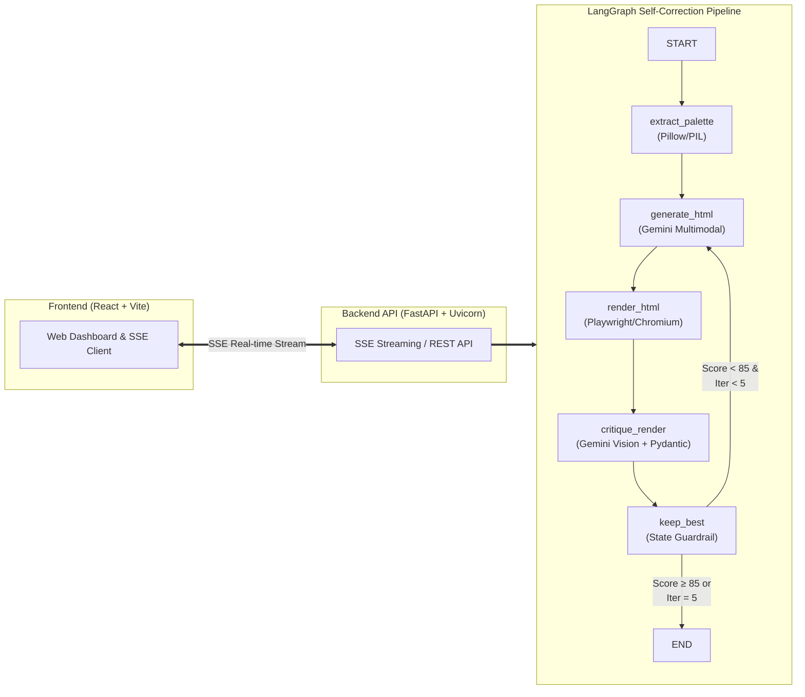

# TECH_STACK.md — PixelForge Tech Stack & Step-by-Step Architecture

*This document provides a comprehensive breakdown of the technology stack used across **the core AI workflow steps**, **the full-stack system architecture layers**, and **the project development phases** of PixelForge (Shot2Code).*

---

## 1. The Core AI Generation Pipeline (The 6 Execution Steps)

This table explains the step-by-step self-correcting loop executed every time a screenshot is converted into code (`START → extract_palette → generate_html → render_html → critique_render → keep_best → END/REPEAT`):

| Step | Node / Module | Tech Stack Used | Type | What That Step is Doing |
| :--- | :--- | :--- | :--- | :--- |
| **Step 1** | **`extract_palette`** `graph/nodes/palette.py` | **Python 3.11+** **Pillow (PIL)** | Deterministic Code | Uses Pillow's `quantize()` algorithm to extract the **6 dominant hex colors** from the target screenshot. Eliminates AI hex hallucination by forcing exact colors. |
| **Step 2** | **`generate_html`** `graph/nodes/generate.py` | **Google Gemini (`gemini-flash-latest`)** **`langchain-google-genai`** **Tailwind CSS CDN** | AI Vision Model | Takes the target screenshot + extracted palette and generates a **single-file responsive Tailwind HTML page**. On revision turns, applies surgical diff corrections without rewriting from scratch. |
| **Step 3** | **`render_html`** `graph/nodes/render.py` | **Microsoft Playwright** **Headless Chromium** **Python `asyncio`** | Deterministic Code | Boots a headless Chromium browser at **1280×800** viewport, renders the HTML produced in Step 2, and takes a **PNG screenshot** (converted to Base64). |
| **Step 4** | **`critique_render`** `graph/nodes/critique.py` | **Google Gemini Vision API** **LangChain Structured Output** **Pydantic v2** | AI Vision Model | Compares the target screenshot side-by-side with the Playwright render. Outputs a Pydantic-validated `Critique` schema containing a **score (0–100)** and up to **6 concrete layout/color/typography discrepancies**. |
| **Step 5** | **`keep_best`** `graph/nodes/keep_best.py` | **Python State Management** `TypedDict` | Deterministic Code | Acts as a regression guard. Compares the current turn's score against `best_score` and retains the highest-scoring HTML/render so oscillating scores never degrade the final output. |
| **Step 6** | **`Router & Loop Control`** `graph/builder.py` | **LangGraph** `StateGraph` & `MemorySaver` | Graph Engine | Evaluates conditional edges: if `best_score >= 85` or `iterations >= 5`, terminates the graph. Otherwise, loops back to `generate_html` with the critique feedback. |

---

## 2. Full-Stack System Architecture Layers

This table explains the tech stack used across each structural layer of the application:

| Layer | Tech Stack Used | What That Layer is Doing |
| :--- | :--- | :--- |
| **Frontend Web UI** | **React 18 + Vite** **Vanilla CSS / Tailwind** **Lucide Icons** **Server-Sent Events (SSE) Client** | Provides an interactive web dashboard (`http://localhost:5173`) where users drag-and-drop screenshots, inspect per-iteration progress in real-time, view the side-by-side `Filmstrip`, and copy the generated HTML. |
| **Backend Web API** | **FastAPI + Uvicorn** **Server-Sent Events (SSE)** **Pydantic v2 + CORS Middleware** | Exposes REST endpoints to trigger runs and streams real-time per-iteration updates (`iteration_start`, `iteration_end`, `run_complete`) directly to the browser via SSE. |
| **Orchestration Graph** | **LangGraph** `langgraph`, `langchain-core` | Manages stateful cyclic graph execution, checkpointing (`MemorySaver`), and passing the shared state (`TypedDict`) cleanly across nodes. |
| **Vision & LLM Engine** | **Google Gemini (`gemini-flash-latest`)** `ChatGoogleGenerativeAI` | Performs multimodal visual understanding for both HTML layout generation and side-by-side visual diffing/critique. |
| **Rendering & Graphics** | **Playwright (Chromium)** **Pillow (`PIL`)** | Handles deterministic browser rendering, screenshot capture, palette extraction, and generating horizontal Filmstrip summary PNGs. |
| **CLI & Evaluation Tools** | **Python CLI (`run_cli.py`)** **Target Maker (`make_targets.py`)** | Allows running standalone CLI benchmarks (`python run_cli.py target.png`) and generating benchmark UI targets (`pricing_card`, `login_form`, `stat_row`). |
| **Containerization & Ops** | **Docker + Docker Compose** `Dockerfile`, `docker-compose.yml` | Bundles Python 3.11, Node.js 18, and Chromium browser binaries into a reproducible container environment. |

---

## 3. Step-by-Step Making of the Project (Development Phases)

This table explains how the project was built from the ground up:

| Phase | Step Name | Primary Tech Stack | What Was Built & Accomplished |
| :---: | :--- | :--- | :--- |
| **Phase 1** | **Core Engine & Self-Correcting Graph** | **Python, LangGraph, Playwright, Pillow, Gemini API, Pydantic** | Created the 6-node LangGraph pipeline (`extract_palette`, `generate_html`, `render_html`, `critique_render`, `keep_best`), set up Pydantic schemas, built the CLI runner (`run_cli.py`), and verified self-correcting score improvements on target screenshots. |
| **Phase 2** | **Real-Time Backend API & React Web UI** | **FastAPI, SSE, React 18, Vite, Lucide Icons, CSS** | Built the FastAPI backend (`api.py`) with Server-Sent Events (SSE) streaming and developed the React frontend (`Filmstrip.jsx`, `PaletteStrip.jsx`, `IterationCard.jsx`, `LivePreview.jsx`) so users can watch the AI critique and revise itself live. |
| **Phase 3** | **Evaluation, Benchmarking & Dockerization** | **Python Scripting, Markdown, Docker, Docker Compose** | Wrote benchmark target generation (`make_targets.py`), recorded empirical iteration improvements, documented technical design decisions (`DECISIONS.md`, `IMPLEMENTATION.md`), and containerized the full stack for one-command deployment. |

---

## 4. System Workflow Diagram

